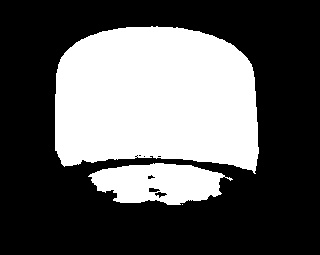
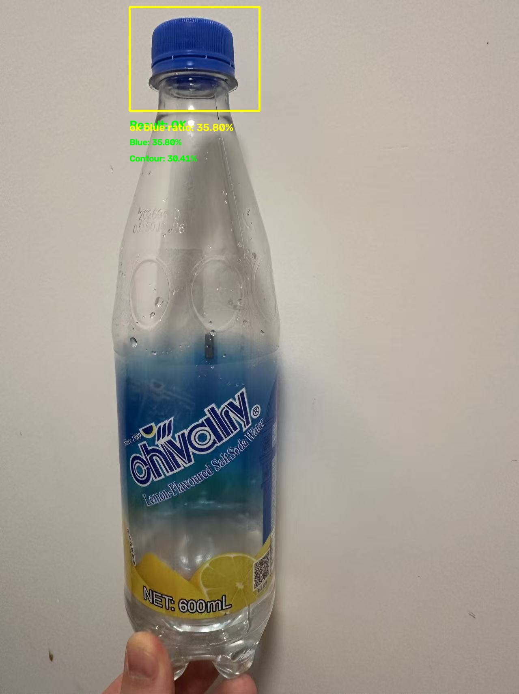
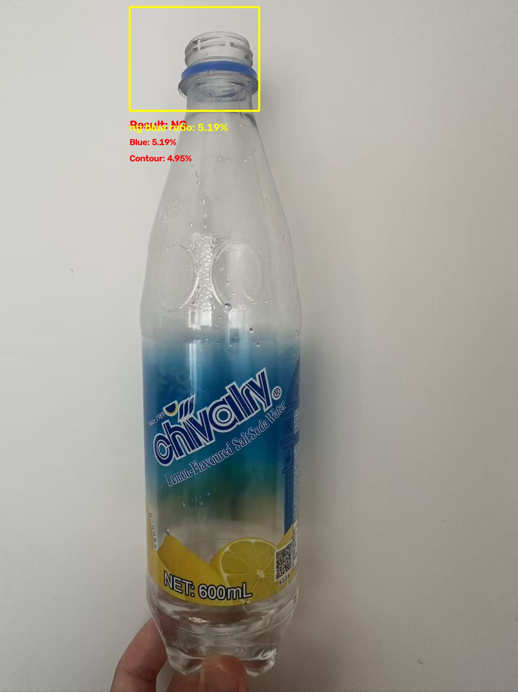

# OpenCV Blue Cap Inspection Baseline

A lightweight traditional computer vision prototype for detecting whether a blue bottle cap is present in a fixed inspection region.

## Overview

This project is a simple industrial quality-inspection baseline developed using Python and OpenCV.

The system analyzes a fixed bottle-cap region, extracts blue areas using HSV color segmentation, cleans the binary mask with morphological operations, analyzes the largest contour, and finally outputs an `OK` or `NG` inspection result.

The purpose of this project is to understand a complete traditional computer vision workflow before moving on to learning-based methods such as YOLO and YOLO-Pose.

## Inspection Pipeline

The current processing pipeline is:

1. Read the input image
2. Extract a fixed bottle-cap Region of Interest (ROI)
3. Convert the ROI from BGR to HSV
4. Segment blue pixels using `cv2.inRange`
5. Apply morphological opening to remove small white noise
6. Apply morphological closing to fill small black holes
7. Calculate the blue-pixel ratio
8. Find external contours in the cleaned mask
9. Calculate the largest-contour area ratio
10. Combine two thresholds to output `OK` or `NG`

```text
Input Image
    ↓
Fixed Bottle-Cap ROI
    ↓
BGR to HSV
    ↓
Blue Color Segmentation
    ↓
Binary Mask
    ↓
Morphological Opening and Closing
    ↓
Blue-Pixel Ratio
    ↓
Largest Contour Analysis
    ↓
OK / NG Decision
```

## Decision Logic

The current prototype uses two conditions:

- Blue-pixel ratio must be greater than or equal to `20%`
- Largest-contour area ratio must be greater than or equal to `15%`

Only when both conditions are satisfied is the sample classified as `OK`.

```python
BLUE_RATIO_THRESHOLD = 0.20
CONTOUR_RATIO_THRESHOLD = 0.15

inspection_ok = (
    blue_ratio >= BLUE_RATIO_THRESHOLD
    and largest_contour_ratio >= CONTOUR_RATIO_THRESHOLD
)
```

## Current Results

| Sample | Blue-Pixel Ratio | Largest-Contour Ratio | Result |
|---|---:|---:|---|
| Normal blue cap | 35.80% | 30.41% | OK |
| Missing cap | 5.19% | 4.95% | NG |

The normal sample contains a large and continuous blue region.

The missing-cap sample still contains a small amount of blue due to reflection or residual blue regions, but its total blue-pixel ratio and largest-contour ratio are both significantly lower.

## Example Masks

### Normal Sample Mask

The normal sample produces a large and mostly continuous white area representing the detected blue bottle cap.



### Missing-Cap Sample Mask

The missing-cap sample contains only a small residual white region and does not form a sufficiently large blue object.


## Example Results

### Normal Sample



### Missing-Cap Sample



## Project Structure

```text
opencv-blue-cap-inspection/
├── src/
│   └── main.py
├── examples/
│   ├── sample_ok.jpg
│   └── sample_ng.jpg
├── assets/
│   ├── ok_mask.jpg
│   ├── ng_mask.jpg
│   ├── ok_contour.jpg
│   ├── ng_contour.jpg
│   ├── ok_final_result.jpg
│   └── ng_final_result.jpg
├── README.md
├── requirements.txt
└── .gitignore
```

The exact asset filenames may be adjusted according to the generated output files.

## Technologies Used

- Python
- OpenCV
- NumPy

Main OpenCV operations used in this project include:

- `cv2.imread`
- `cv2.cvtColor`
- `cv2.inRange`
- `cv2.getStructuringElement`
- `cv2.morphologyEx`
- `cv2.countNonZero`
- `cv2.findContours`
- `cv2.contourArea`
- `cv2.boundingRect`
- `cv2.rectangle`
- `cv2.putText`
- `cv2.imwrite`

## Installation

Clone the repository:

```bash
git clone https://github.com/YOUR_USERNAME/opencv-blue-cap-inspection.git
cd opencv-blue-cap-inspection
```

Create a virtual environment:

```bash
python -m venv .venv
```

Activate the virtual environment on Windows PowerShell:

```powershell
.\.venv\Scripts\Activate.ps1
```

Install the required packages:

```bash
pip install -r requirements.txt
```

## Requirements

The `requirements.txt` file contains:

```text
opencv-python
numpy
```

## Run the Project

Run the main program from the project root:

```bash
python src/main.py
```

The program reads:

```text
examples/sample_ok.jpg
examples/sample_ng.jpg
```

Generated results are saved to:

```text
output/
```

## Key Concepts Learned

This project demonstrates several traditional computer vision concepts.

### Region of Interest

A fixed ROI is used to limit the analysis to the expected bottle-cap area and reduce interference from the label, liquid, bottle body, and background.

### HSV Color Space

HSV separates color information from brightness information more clearly than BGR.

- `H`: Hue
- `S`: Saturation
- `V`: Value

The blue range is manually defined and passed to `cv2.inRange`.

### Binary Mask

Pixels within the selected HSV range become white, while pixels outside the range become black.

The mask is used for numerical analysis and contour extraction.

### Morphological Opening

Opening performs erosion followed by dilation.

It is mainly used to remove small isolated white noise while approximately preserving the main object.

### Morphological Closing

Closing performs dilation followed by erosion.

It is mainly used to fill small black holes and small gaps inside the detected blue region.

### Contour Analysis

`cv2.findContours` detects connected white-region boundaries in the binary mask.

The largest contour is used to estimate whether the detected blue pixels form one sufficiently large and continuous object.

## Limitations

The current implementation is a small proof-of-concept and has several limitations.

### Fixed ROI

The bottle cap must appear within a predefined image region.

If the bottle position, scale, or camera angle changes significantly, the ROI may no longer cover the cap correctly.

### Fixed HSV Thresholds

The manually selected blue HSV range may be affected by:

- Lighting changes
- Camera white balance
- Shadows
- Reflections
- Bottle-cap material
- Background color

### Small Test Set

The current experiment only contains a limited number of normal and abnormal samples.

The current thresholds cannot yet be considered production-ready.

### Color-Based Detection

The system detects large blue regions rather than semantically recognizing a bottle cap.

A blue object placed inside the ROI may potentially cause a false positive.

### No Dynamic Object Localization

The current system cannot automatically locate the bottle or bottle cap when the object position changes.

## Future Work

Possible improvements include:

- Collect more normal and abnormal samples
- Test under different lighting conditions
- Add batch evaluation
- Calculate accuracy, precision, recall, false positives, and false negatives
- Automatically determine more reliable thresholds from sample distributions
- Add contour-shape features such as aspect ratio, solidity, and extent
- Add adaptive or calibrated color thresholds
- Use YOLO to dynamically locate the bottle or cap region
- Use YOLO-Pose to detect positioning keypoints
- Add video or real-time camera input
- Export inspection results to CSV or JSON
- Save failure images and failure reasons automatically

## Development Motivation

This project was created as an introductory exercise before working on more advanced computer vision tasks.

Although the algorithm is simple, it covers a complete quality-inspection workflow:

- Define the inspection target
- Restrict the inspection area
- Extract useful visual features
- Remove noise
- Analyze connected regions
- Define decision thresholds
- Output inspection results
- Identify limitations and possible improvements

It serves as a traditional computer vision baseline before moving toward YOLO-based detection, pose estimation, and more complex industrial inspection systems.

## Disclaimer

This project is an educational prototype.

It is not intended to be used directly in a commercial production environment without additional data collection, testing, calibration, and robustness evaluation.